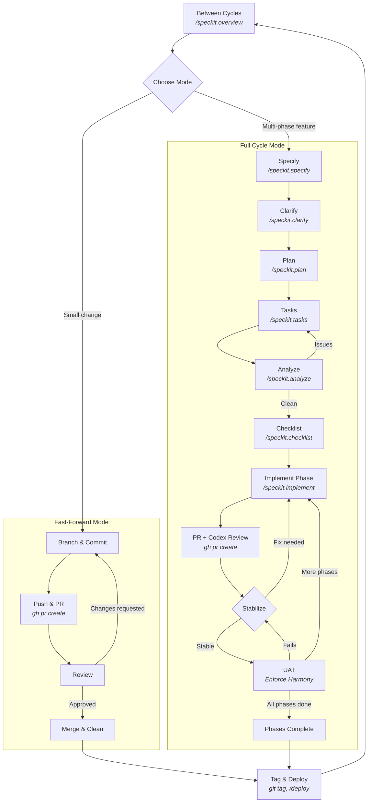
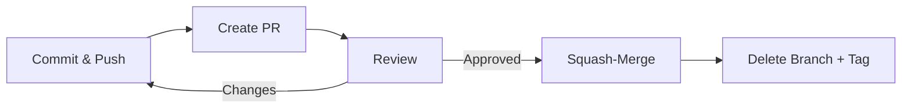

# Feature Cycle

**Version**: 2.0.0 | **Applies to**: Everard / lotsdb | **Last updated**: 2026-02-16

This document defines the full lifecycle of a feature from inception through
production. It supports two modes — **Full Cycle** for multi-phase features
and **Fast-Forward** for small changes — and describes the between-cycle
hygiene that keeps `main` clean.

Run `/speckit.overview` at any time to see where you are in the cycle.

---

## Cycle Overview



---

## 0. Mode Selection — Choose Your Path

Before starting work, decide which mode fits the change.

| | Full Cycle | Fast-Forward |
|---|---|---|
| **Use when** | New features, multi-file behavioral changes, anything needing spec artifacts | Bug fixes <50 LOC, config tweaks, doc-only, dependency bumps, single-file refactors |
| **Artifacts** | spec.md, plan.md, tasks.md, contracts, checklists | PR description + commit message |
| **PRs** | One or more (per implementation phase) | One |
| **Tag** | One, after all phases merge | One, after merge |
| **Traceability** | Full spec → code → test → doc chain | PR description is source of truth |

**Heuristic:** If a commit message fully describes the change, use Fast-Forward.
If you would write a `spec.md` for it, use Full Cycle.

---

## 1. Between Cycles — Clean Slate

Before starting any new feature, the repository must be in a known-good state.
Run `/speckit.overview` to check readiness.

**Checklist:**

- [ ] On `main` branch, working tree clean
- [ ] All feature branches merged via squash-merge and deleted (local + remote)
- [ ] `git fetch --prune` run; no stale remote refs
- [ ] All specs in `specs/` reflect delivered state (no lingering `[ ]` tasks)
- [ ] `CLAUDE.md` auto-generated section is current (run update-agent-context if needed)
- [ ] Tag the release point: `git tag vN.N.N`

> **Suggested tooling:** Consider creating a `/speckit.housekeep` skill that:
> prunes merged remote branches, validates all `tasks.md` files are complete,
> tags the release, and updates `CLAUDE.md`.

---

## 2. Fast-Forward Mode

For small, self-contained changes that don't warrant the full speckit pipeline.

### Steps

1. **Branch**: `git checkout -b NNN-short-name`
2. **Commit**: Make changes, commit with a descriptive message explaining what and why
3. **Push**: `git push -u origin NNN-short-name`
4. **PR**: `gh pr create --title "..." --body "..."`
   - The PR body serves as the spec — include context, what changed, and why
5. **Review**: Codex or human reviews the PR
   - If changes requested: fix, commit, push, re-review
6. **Merge**: Squash-merge via GitHub
7. **Clean**: Delete branch, prune, tag if warranted

### Fast-Forward Review Loop



### Traceability

Fast-Forward mode still uses `NNN-short-name` branches for traceability.
The commit message and PR description are the source of truth — they must
explain the **what** and **why** clearly enough for future readers.

No spec artifacts are required, but the PR must be self-documenting.

---

## Full Cycle Mode

Sections 3-12 apply when you selected Full Cycle mode for a multi-phase
feature. The feature progresses through specification, design, implementation,
and stabilization — potentially across multiple PRs before a single tag.

---

### 3. Specify — Define the Feature

| | |
|---|---|
| **Skill** | `/speckit.specify <feature description>` |
| **Input** | Natural language feature description |
| **Output** | `specs/NNN-feature-name/spec.md`, feature branch, quality checklist |
| **References** | [Constitution &sect;III Contracted Boundaries], [Spec Template] |

Creates the feature branch (`NNN-feature-name`), generates the specification,
runs quality validation, and surfaces up to 3 clarification questions.

The spec is the **source of truth for intent**. It must be stakeholder-readable,
technology-agnostic, and testable.

---

### 4. Clarify — Reduce Ambiguity

| | |
|---|---|
| **Skill** | `/speckit.clarify` |
| **Input** | Active feature branch with `spec.md` |
| **Output** | Updated `spec.md` with clarifications integrated |
| **References** | [Constitution &sect;I Artifact Harmony], [Constitution &sect;III Contracted Boundaries] |

Interactive sequential questioning (max 5) targeting the highest-impact
ambiguities. Each accepted answer is integrated inline into the spec
immediately. Skip if the spec emerged clean from `/speckit.specify`.

---

### 5. Plan — Design the Solution

| | |
|---|---|
| **Skill** | `/speckit.plan` |
| **Input** | Clarified `spec.md` |
| **Output** | `plan.md`, `research.md`, `data-model.md`, `contracts/`, `quickstart.md` |
| **References** | [Constitution &sect;II Executable Knowledge], [Constitution &sect;III Contracted Boundaries], [Plan Template] |

Generates the full technical design: architecture, data model, API contracts,
and research decisions. Contracts are defined **before** implementation begins
(Constitution &sect;III). The agent context file (`CLAUDE.md`) is updated with
new technologies.

---

### 6. Tasks — Break Down the Work

| | |
|---|---|
| **Skill** | `/speckit.tasks` |
| **Input** | `plan.md` + `spec.md` + design artifacts |
| **Output** | `tasks.md` — dependency-ordered, user-story-organized task list |
| **References** | [Constitution &sect;IV Versioned Traceability], [Tasks Template] |

Every task gets a checkbox, sequential ID, story label, parallel marker, and
file path. Phases: Setup, Foundational, User Stories (priority order), Polish.

---

### 7. Analyze — Cross-Artifact Consistency Check

| | |
|---|---|
| **Skill** | `/speckit.analyze` |
| **Input** | `spec.md` + `plan.md` + `tasks.md` |
| **Output** | Read-only analysis report (no file modifications) |
| **References** | [Constitution &sect;I Artifact Harmony], [Constitution — all principles] |

Detects duplications, ambiguities, coverage gaps, terminology drift, and
constitution violations across the three core artifacts. Severity levels:
CRITICAL / HIGH / MEDIUM / LOW.

If CRITICAL issues exist, loop back to `/speckit.tasks` or `/speckit.plan` to
resolve before proceeding.

---

### 8. Checklist — Domain-Specific Quality Gates

| | |
|---|---|
| **Skill** | `/speckit.checklist <domain>` |
| **Input** | Feature context + domain focus (ux, api, security, etc.) |
| **Output** | `specs/NNN-feature-name/checklists/<domain>.md` |
| **References** | [Constitution &sect;II Executable Knowledge], [Checklist Template] |

Checklists are **unit tests for requirements** — they validate the quality of
the spec, not the implementation. Generate as many domain checklists as needed
before implementation begins.

---

### 9. Implement — Execute the Plan

| | |
|---|---|
| **Skill** | `/speckit.implement` |
| **Input** | Complete `tasks.md` + all design artifacts |
| **Output** | Working code, tests passing, tasks marked `[X]` |
| **References** | [Constitution &sect;I Artifact Harmony], [Constitution &sect;II Executable Knowledge] |

Phase-by-phase execution following the task plan. TDD approach when tests are
specified. Checklist completion is validated before starting. Each completed
task is marked off in `tasks.md`.

#### Multi-Phase Implementation

For large features, implementation can be split across multiple phases. Each
phase implements a subset of tasks from `tasks.md` (e.g., Phase 1 = US1 + US2,
Phase 2 = US3 + US4).

Each phase:

1. Implements its subset of tasks
2. Creates its own PR (see Section 10)
3. Goes through Codex review and stabilization (Section 11)
4. Passes UAT (Section 12)
5. Gets squash-merged into `main`
6. Next phase begins back at this step (Implement)

All phases share the same feature branch, spec artifacts, and final tag.
The feature is not "done" until all phases have merged.

---

### 10. PR + Codex Review — External Stabilization

| | |
|---|---|
| **Tool** | `gh pr create`, then Codex agent review |
| **Input** | Feature branch with phase implementation complete |
| **Output** | Pull request with structured review |
| **References** | [Constitution — PR Review Protocol], [Constitution &sect;IV Versioned Traceability] |

After `/speckit.implement` completes a phase:

1. **Create the PR** using `gh pr create` with a summary referencing the spec.
   For multi-phase features, include the phase in the title:
   `Feature NNN: phase M of N — <description>`
2. **Codex reviews the PR** against the PR Review Protocol (Constitution &sect;PR Review Protocol):
   - Step 0: Locate artifacts in `specs/NNN-feature-name/`
   - Step 1: Spec ↔ Code (every FR has code, no undocumented behavior)
   - Step 2: Contract ↔ Code (schemas match)
   - Step 3: Tests ↔ Spec (acceptance scenarios covered)
   - Step 4: Docs ↔ Code (quickstart paths accurate)
   - Step 5: Tasks ↔ Completion (all tasks `[X]` for this phase)
   - Step 6: Cross-artifact consistency
3. **Codex produces a verdict**: APPROVE / REQUEST CHANGES / APPROVE WITH NOTES

> **Suggested tooling:** Consider creating a `/speckit.review` skill that
> automates the PR Review Protocol as a structured checklist, producing a
> formatted review comment.

---

### 11. Stabilization & Hardening Loop


This is an iterative loop between implementation and review:

1. **Codex identifies issues** via PR Review Protocol
2. **Fixes are applied** (back to `/speckit.implement` or manual edits)
3. **Push and re-review** until APPROVE verdict
4. **Regression check**: run full test suite after each fix round

The loop exits only when Codex produces APPROVE or APPROVE WITH NOTES (with
all notes acknowledged).

> **Suggested tooling:** Consider a `/speckit.stabilize` skill that:
> reads the latest PR review comments, extracts actionable findings, creates
> fix tasks in `tasks.md`, executes fixes, and pushes — automating the
> fix-push-review cycle.

---

### 12. UAT — Enforce Harmony

User Acceptance Testing validates that all artifacts are in harmony before
merging. This is the constitution's prime directive (Principle I) made
operational.

#### UAT Protocol: The Harmony Enforcement Pipeline


#### After UAT Passes

- **More phases remaining?** Loop back to Section 9 (Implement) for the next phase
- **All phases done?** Proceed to Section 13 (Deploy)

#### UAT Template

For each feature (or phase), complete this checklist before merging:

**Step 1 — Understand Specs & Contracts**
- [ ] Read `spec.md` — all FRs understood
- [ ] Read `contracts/` — all API shapes understood
- [ ] Read `data-model.md` — all entities and relationships understood
- [ ] Cross-reference: contracts implement spec FRs, data model supports contracts

**Step 2 — Derive Expected Test Coverage**
- [ ] For each FR, list what a test SHOULD verify
- [ ] For each contract endpoint, list expected request/response test cases
- [ ] For each edge case in spec, identify expected test scenario
- [ ] Document any gap between "what should be tested" and "what is tested"

**Step 3 — Evaluate Actual Tests Against Expectations**
- [ ] Every FR has at least one corresponding test
- [ ] Every contract has at least one contract test
- [ ] Edge cases from spec have test coverage
- [ ] Tests assert behavior (not just "runs without error")
- [ ] Any coverage gaps are documented and justified

**Step 4 — Run Tests**
- [ ] `pytest` passes (zero failures)
- [ ] `ruff check .` passes (zero lint errors)
- [ ] No skipped tests without documented justification

**Step 5 — Documentation Review**
- [ ] `quickstart.md` file paths match actual project structure
- [ ] Manual test steps in quickstart are accurate and reproducible
- [ ] Sphinx docs (if present) build without warnings
- [ ] Terminology in docs matches spec and code

**Step 6 — Verdict**
- [ ] **SHIP**: All steps pass — proceed to deploy (or next phase)
- [ ] **FIX**: Issues found — return to Stabilization Loop (Section 11)

> **Suggested tooling:** Consider creating a `/speckit.uat` skill that
> automates this template: reads the spec, derives expected test coverage,
> compares against actual test files, runs the test suite, and validates docs.

---

### 13. Deploy

| | |
|---|---|
| **Skill** | `/deploy` |
| **Input** | `main` branch, up to date with origin |
| **Output** | Production updated and service restarted |

Deploys by SSH into the production server, pulling latest `main`, and
restarting the service.

---

### 14. Close Cycle — Merge, Prune, Tag

After successful deploy, close the cycle. For multi-phase features, this
happens once after **all** phases have merged — not per-phase.

1. **Squash-merge** the feature branch into `main` (if not already done via PR)
2. **Delete** the feature branch locally and remotely:
   ```
   git branch -d NNN-feature-name
   git push origin --delete NNN-feature-name
   ```
3. **Prune** stale remote refs: `git fetch --prune`
4. **Tag** the release: `git tag vN.N.N` (one tag per feature, regardless of phase count)
5. **Verify** clean state: `git status` shows clean working tree on `main`
6. **Update agent context**: run `.specify/scripts/bash/update-agent-context.sh claude`

> **Suggested tooling:** Same `/speckit.housekeep` skill suggested in
> Section 1 would handle this.

---

## Quick Reference: Skills & Tools by Phase

| Phase | Skill / Tool | Mode | Exists? |
|-------|-------------|------|---------|
| Overview (any time) | `/speckit.overview` | Both | Yes |
| Between Cycles | — | Both | No. See: `/speckit.housekeep` |
| Fast-Forward | `git`, `gh pr create` | FF | Yes (CLI) |
| Specify | `/speckit.specify` | Full | Yes |
| Clarify | `/speckit.clarify` | Full | Yes |
| Plan | `/speckit.plan` | Full | Yes |
| Tasks | `/speckit.tasks` | Full | Yes |
| Analyze | `/speckit.analyze` | Full | Yes |
| Checklist | `/speckit.checklist` | Full | Yes |
| Implement | `/speckit.implement` | Full | Yes |
| PR Creation | `gh pr create` | Both | Yes (CLI) |
| Codex Review | — | Full | No. See: `/speckit.review` |
| Stabilization | — | Full | No. See: `/speckit.stabilize` |
| UAT | — | Full | No. See: `/speckit.uat` |
| Deploy | `/deploy` | Both | Yes |
| Close Cycle | — | Both | No. See: `/speckit.housekeep` |
| Tasks to Issues | `/speckit.taskstoissues` | Full | Yes |
| Constitution | `/speckit.constitution` | Both | Yes |

---

## Artifact References

| Artifact | Location | Authority |
|----------|----------|-----------|
| Constitution | `.specify/memory/constitution.md` | Governance — supersedes all other practices |
| Spec Template | `.specify/templates/spec-template.md` | Structure for all `spec.md` files |
| Plan Template | `.specify/templates/plan-template.md` | Structure for all `plan.md` files |
| Tasks Template | `.specify/templates/tasks-template.md` | Structure for all `tasks.md` files |
| Checklist Template | `.specify/templates/checklist-template.md` | Structure for all checklist files |
| Constitution Template | `.specify/templates/constitution-template.md` | Base template for constitution |
| PR Review Protocol | Constitution &sect;PR Review Protocol | 6-step review process |
| The Flywheel | Constitution &sect;The Flywheel | Artifact harmony reinforcement loop |

---

## Amendments

Changes to this cycle document follow the same governance as the constitution:

1. Documented rationale
2. Review approval
3. Version bump (this document follows semver independently)

When a new skill is created to fill a gap identified in this document, update
the Quick Reference table and remove the "Suggested tooling" note from the
relevant section.
